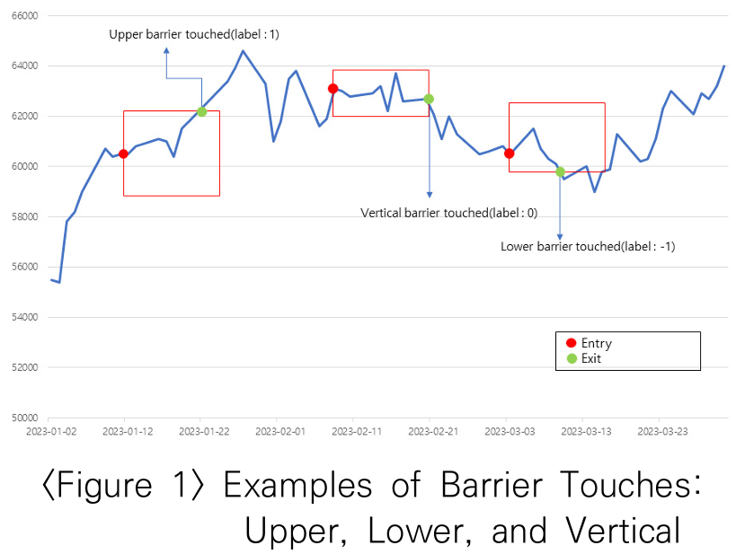

# 요약
## 서론
전통적인 금융 분야 분석 방법 : **선형회귀**를 통한 경제변수 간의 관계 분석
➡️ 시장 데이터 사이의 선형적 관계를 바탕으로 하여 자산의 가격을 결정하는데 도움

⚠️금융 시장 분석에서 선형 회귀의 한계
- 여러 복잡한 요소들이 얽혀있음
  - 실제 금융 시장의 비선형적 특성
  - 시장 참여자들의 예측 불가능한 행동
  - 외부 경제적 사건들의 영향
➡️ 머신러닝 활용
  - Random forest, 신경망, SVM 같은 머신러닝 알고리즘은 대규모 데이터 셋 속에 숨겨진 패턴 포착 가능(**시장 예측 가능성** - 수익률, 위험관리, 포트폴리오 최적화 등의 전략 탐색 가능)
  - ⚠️머신러닝 주의사항
    - 통계적 우연을 실제 패턴으로 잘못 인식 가능 -> 낮은 신호 대 잡음 비와 결합하여 무수한 거짓 발견 양산할 수 있음

#### ➡️ 논문의 방향성 : 국내 금융 데이터의 특성을 심도 있게 분석하고 이를 기반으로 실제 시장 상황에 적합한 학습 데이터를 구성하여 머신러닝 기법을 적용
- 목표 : **고빈도 데이터**를 활용하여 장중 주가 방향을 예측할 수 있는 머신러닝 모형 개발 후 효과 검증
- 연구 방식 개요 : 주식시장의 일 중 데이터를 활용하여 달러바 생성, 이벤트 기반의 데이터 샘플링, 삼중 배리어 방식을 통해 데이터 라벨링하여 학습하여 우수한 예측모형 생성

---
## 이론적 배경
### 1) 장중 주가 패턴과 수익 기회
```
❓장중 패턴(intraday pattern)은 어떻게 예측하나요?
주식시장의 구조적 특성, 투자자들의 행동적 편향, 기관의 체계적인 거래 활동으로 인해 예측 가능한 장중 패턴 분석
```
1. 뉴욕 증권 시장의 U형 패턴(1985, Wood et al)
- 개장 직후 및 폐장 전의 수익률이 다른 시간대에 비해 높은 현상

2. 가격 반전 현상(2006, Avramov et al)
- 주가가 급락한 후 유동성 제공자에게 제공되는 보상으로 인해 차익이 발생하는 현상

3. 30분 수익률(2010, Hoston et al)
- 30분 수익률은 과거 거래일의 같은 시간대 수익률과 유의한 양의 관계가 있고, 이 특징이 40거래일동안 지속하는 경향을 보임

4. 장중 모멘텀(2018, Gao et al)
- 장중 첫 30분의 수익률이 마지막 30분의 수익률을 예측하는 데 중요한 역할을 함
- 왜 이러한 현상이 발생하는가
  - 기관투자자들이 장 초반과 장 마감 시 유동성이 높은 시간에 포트폴리오를 조정하는 경향
  - 정보를 늦게 접해 장 초반 매수 기회를 놓치는 투자자들이 장 후반에 유동성이 높을 때 매수에 나서는 행동

5. 일 중 주기성 패턴(2022, 김찬수)
- 장 초반 10분은 전일과 반대로, 장 후반 30분은 전일과 동방향으로 10분위 long-short 포트폴리오를 구성한 결과 유의한 양의 수익률이 나타남

### 2) 시간 바와 달러 바
- ⚠️시간 바의 단점
1) 시장은 정보를 균등한 시간 간격으로 처리하지 않음
- 특히 기술의 발전으로, 일정한 시간에만 주문을 내는 거래 방식은 예측 가능한 패턴으로 인해 알고리즘의 공격 대상이 될 수 있음

2) 시간 기준으로 추출된 데이터는 통계적으로 불리한 특성을 보이는 경향 有
- 자기 상관성, 이분산성, 비정규분포 등의 문제는 통계적 분석 방법을 적용할 때 오류 발생시킬 수 있음
```
❓시간 기준으로 자르면 왜 자기상관성, 이분산성, 비정규분포의 문제가 생기는가

✔️ 자기상관성 ex. 1분 단위 수익률이 바로 직전 1분 수익률과 비슷하게 움직일 때 자기 상관 발생 -> 이런 상황이 많아지면 통계모델을 적용할 때 독립성 가정이 깨져서 오류가 생길 수 있음

✔️ 이분산성 ex. 1분 단위로 자르면, 정적인 시간대와 활발한 시간대 데이터가 같은 비중으로 들어감 -> 분산이 들쑥날쑥하게 보임

✔️ 비정규분포 ex. 시간 단위로 자르면, 거의 없는 구간은 변동이 0에 가까운 값이 많고, 몰릴 때는 극단적인 값이 튀어나옴 -> 분포가 한쪽으로 치우치고 꼬리가 두꺼워져서 정규분포가정이 깨짐
```

3) 시장의 변동성이 높을 때는 데이터를 과소 추출하고, 변동성이 낮을 때는 과대 추출하는 경향이 있어 학습 시 데이터의 불균형이 초래됨

#### 💡대안 : 달러 바(특정 거래 금액을 기준으로 데이터를 생성하는 방법)
- 변동성이 높은 시장 상황에서는 더 많은 데이터를, 변동성이 낮은 상황에서는 적은 데이터를 샘플링하여 실제 시장의 역동성을 반영

### 3) 삼중 배리어


- 전통적인 금융 머신러닝 연구 : 상승 혹은 하락 같은 이진 분류를 사용하거나, 고정된 수익률을 기준으로 데이터를 라벨링하는 방식에 집중 ➡️ 개별 주식 변동성을 충분히 반영하지 못하는 단점

💡 삼중배리어
- 구성
  - 위쪽 수평 배리어(Upper horizontal barrier) = 목표 수익선(Profit target)
  - 아래쪽 수평 배리어(Lower horizontal barrier) = 손절매선(Stop loss)
  - 수직 배리어(Vertical barrer) = 만기(expiration, 지나간 바의 개수)
- 삼중배리어 라벨링
  - 주가가 upper 수평 배리어에 닿으면 라벨 1 ("예상대로 올라감")
  - 주가가 lower 수평 배리어에 닿으면 라벨 -1("예상과 반대로 내려감")
  - 일정 시간이 지나도 위, 아래 아무 장벽도 안건드리면 라벨 0 

### 4) 랜덤 포레스트
- 복잡한 데이터 셋에서 높은 예측 성능을 제공
- 알고리즘 작동 메커니즘
  - 1) 부트스트랩 샘플링을 사용하여 원본 데이터로부터 여러 개의 훈련 데이터 셋을 생성 - 각 데이터 셋은 원본 데이터의 일부를 무작위로 선택하여 구성되며, 모형의 다양성이 증가함
  - 2) 결정 트리를 구축할 때 사용될 특성들을 무작위로 선택 -> 각 결정 트리가 데이터의 다른 측면을 학습하도록 하여 전체 모형의 견고함을 향상
    - 개별 트리들 사이의 상관관계를 줄이며, 배깅을 통해 과대적합을 방지하는 데 기여
  - 3) 각각 독립적으로 학습된 결정 트리들의 예측 결과를 집계하여 최종 예측을 도출

### 5) 머신러닝과 수익률 예측
- 최근 금융 분야에서 머신러닝의 경향성 : 자산 가격 예측 및 트레이딩 전략에 머신러닝을 접목하는 것이 주목 받음
  - 1) 트레이딩 전략을 개선하기 위한 라벨링 방법에 관한 연구(머신러닝 모형이 시장을 학습하는데 필요한 학습 데이터 셋 구축 중요성 강조)

  - 2) 머신러닝 모형을 활용하여 주가 동락을 예측하는 연구(어떤 머신러닝 모델이 가장 주가 동락 예측을 잘할지)


---

#### 용어 정리
- 볼린저밴드(Bollinger Band) : 주가가 평균에서 얼마나 벗어났는지를 보여주는 기술적 지표
  - 중심선 = 이동평균선(보통 20일 평균)
  - 상단선 = 평균 + 표준편차 x k
  - 하단선 = 평균 - 표준편차 x k

- 달러바(*거래 규모 기반*으로 만든 새로운 시계열 데이터 단위) : 시간 대신 **거래금액(=가격*거래량)**을 기준으로 데이터 포인트를 만듦(누적 거래대금이 특정 임계치를 넘으면 새로운 바 생성)
  - <-> *시간바*
    - 예시 : n분봉(n분마다 가격, 거래량 기록) - 각 바 안에는 그 구간의 시가, 고가, 저가, 종가, 거래량 등의 값 기록
    - 문제점 : 거래의 활발함과 상관없이 1분에 동일한 개수만 측정하여 정보 왜곡 발생
  - 달러바의 장점 : 극단값(최고가, 최저가)의 왜곡을 줄이고, 분포가 정규분포에 더 가까움

- 자기 상관성(autocorrelation) : 한 시점의 데이터와 과거 시점의 데이터가 얼마나 서로 연관되어 있는지를 나타내는 통계적 개념(ex. 오늘 값이 어제 값에 영향을 받는 정도)

- 배깅 Bootstrap Aggregating(앙상블 방식 중 하나) : 여러 개의 학습 모델을 독립적으로 학습시킨 뒤, 그 결과를 합쳐서 최종 예측을 내는 앙상블 학습 기법

