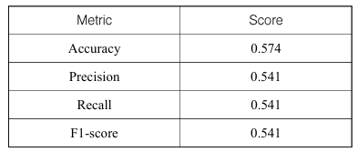

# 요약
## 서론
전통적인 금융 분야 분석 방법 : **선형회귀**를 통한 경제변수 간의 관계 분석
➡️ 시장 데이터 사이의 선형적 관계를 바탕으로 하여 자산의 가격을 결정하는데 도움

⚠️금융 시장 분석에서 선형 회귀의 한계
- 여러 복잡한 요소들이 얽혀있음
  - 실제 금융 시장의 비선형적 특성
  - 시장 참여자들의 예측 불가능한 행동
  - 외부 경제적 사건들의 영향
➡️ 머신러닝 활용
  - Random forest, 신경망, SVM 같은 머신러닝 알고리즘은 대규모 데이터 셋 속에 숨겨진 패턴 포착 가능(**시장 예측 가능성** - 수익률, 위험관리, 포트폴리오 최적화 등의 전략 탐색 가능)
  - ⚠️머신러닝 주의사항
    - 통계적 우연을 실제 패턴으로 잘못 인식 가능 -> 낮은 신호 대 잡음 비와 결합하여 무수한 거짓 발견 양산할 수 있음

#### ➡️ 논문의 방향성 : 국내 금융 데이터의 특성을 심도 있게 분석하고 이를 기반으로 실제 시장 상황에 적합한 학습 데이터를 구성하여 머신러닝 기법을 적용
- 목표 : **고빈도 데이터**를 활용하여 장중 주가 방향을 예측할 수 있는 머신러닝 모형 개발 후 효과 검증
- 연구 방식 개요 : 주식시장의 일 중 데이터를 활용하여 달러바 생성, 이벤트 기반의 데이터 샘플링, 삼중 배리어 방식을 통해 데이터 라벨링하여 학습하여 우수한 예측모형 생성

---
## 이론적 배경
### 1) 장중 주가 패턴과 수익 기회
```
❓장중 패턴(intraday pattern)은 어떻게 예측하나요?
주식시장의 구조적 특성, 투자자들의 행동적 편향, 기관의 체계적인 거래 활동으로 인해 예측 가능한 장중 패턴 분석
```
1. 뉴욕 증권 시장의 U형 패턴(1985, Wood)
- 개장 직후 및 폐장 전의 수익률이 다른 시간대에 비해 높은 현상

2. 가격 반전 현상(2006, Avramov)
- 주가가 급락한 후 유동성 제공자에게 제공되는 보상으로 인해 차익이 발생하는 현상

3. 30분 수익률(2010, Hoston)
- 30분 수익률은 과거 거래일의 같은 시간대 수익률과 유의한 양의 관계가 있고, 이 특징이 40거래일동안 지속하는 경향을 보임

4. 장중 모멘텀(2018, Gao)
- 장중 첫 30분의 수익률이 마지막 30분의 수익률을 예측하는 데 중요한 역할을 함
- 왜 이러한 현상이 발생하는가
  - 기관투자자들이 장 초반과 장 마감 시 유동성이 높은 시간에 포트폴리오를 조정하는 경향
  - 정보를 늦게 접해 장 초반 매수 기회를 놓치는 투자자들이 장 후반에 유동성이 높을 때 매수에 나서는 행동

5. 일 중 주기성 패턴(2022, 김찬수)
- 장 초반 10분은 전일과 반대로, 장 후반 30분은 전일과 동방향으로 10분위 long-short 포트폴리오를 구성한 결과 유의한 양의 수익률이 나타남

### 2) 시간 바와 달러 바
- ⚠️시간 바의 단점
1) 시장은 정보를 균등한 시간 간격으로 처리하지 않음
- 특히 기술의 발전으로, 일정한 시간에만 주문을 내는 거래 방식은 예측 가능한 패턴으로 인해 알고리즘의 공격 대상이 될 수 있음

2) 시간 기준으로 추출된 데이터는 통계적으로 불리한 특성을 보이는 경향 有
- 자기 상관성, 이분산성, 비정규분포 등의 문제는 통계적 분석 방법을 적용할 때 오류 발생시킬 수 있음
```
❓시간 기준으로 자르면 왜 자기상관성, 이분산성, 비정규분포의 문제가 생기는가

✔️ 자기상관성 ex. 1분 단위 수익률이 바로 직전 1분 수익률과 비슷하게 움직일 때 자기 상관 발생 -> 이런 상황이 많아지면 통계모델을 적용할 때 독립성 가정이 깨져서 오류가 생길 수 있음

✔️ 이분산성 ex. 1분 단위로 자르면, 정적인 시간대와 활발한 시간대 데이터가 같은 비중으로 들어감 -> 분산이 들쑥날쑥하게 보임

✔️ 비정규분포 ex. 시간 단위로 자르면, 거의 없는 구간은 변동이 0에 가까운 값이 많고, 몰릴 때는 극단적인 값이 튀어나옴 -> 분포가 한쪽으로 치우치고 꼬리가 두꺼워져서 정규분포가정이 깨짐
```

3) 시장의 변동성이 높을 때는 데이터를 과소 추출하고, 변동성이 낮을 때는 과대 추출하는 경향이 있어 학습 시 데이터의 불균형이 초래됨

#### 💡대안 : 달러 바(특정 거래 금액을 기준으로 데이터를 생성하는 방법)
- 변동성이 높은 시장 상황에서는 더 많은 데이터를, 변동성이 낮은 상황에서는 적은 데이터를 샘플링하여 실제 시장의 역동성을 반영

### 3) 삼중 배리어


- 전통적인 금융 머신러닝 연구 : 상승 혹은 하락 같은 이진 분류를 사용하거나, 고정된 수익률을 기준으로 데이터를 라벨링하는 방식에 집중 ➡️ 개별 주식 변동성을 충분히 반영하지 못하는 단점

💡 삼중배리어
- 구성
  - 위쪽 수평 배리어(Upper horizontal barrier) = 목표 수익선(Profit target)
  - 아래쪽 수평 배리어(Lower horizontal barrier) = 손절매선(Stop loss)
  - 수직 배리어(Vertical barrer) = 만기(expiration, 지나간 바의 개수)
- 삼중배리어 라벨링
  - 주가가 upper 수평 배리어에 닿으면 라벨 1 ("예상대로 올라감")
  - 주가가 lower 수평 배리어에 닿으면 라벨 -1("예상과 반대로 내려감")
  - 일정 시간이 지나도 위, 아래 아무 장벽도 안건드리면 라벨 0 

### 4) 랜덤 포레스트
- 복잡한 데이터 셋에서 높은 예측 성능을 제공
- 알고리즘 작동 메커니즘
  - 1) 부트스트랩 샘플링을 사용하여 원본 데이터로부터 여러 개의 훈련 데이터 셋을 생성 - 각 데이터 셋은 원본 데이터의 일부를 무작위로 선택하여 구성되며, 모형의 다양성이 증가함
  - 2) 결정 트리를 구축할 때 사용될 특성들을 무작위로 선택 -> 각 결정 트리가 데이터의 다른 측면을 학습하도록 하여 전체 모형의 견고함을 향상
    - 개별 트리들 사이의 상관관계를 줄이며, 배깅을 통해 과대적합을 방지하는 데 기여
  - 3) 각각 독립적으로 학습된 결정 트리들의 예측 결과를 집계하여 최종 예측을 도출

### 5) 머신러닝과 수익률 예측
- 최근 금융 분야에서 머신러닝의 경향성 : 자산 가격 예측 및 트레이딩 전략에 머신러닝을 접목하는 것이 주목 받음
  - 1) 트레이딩 전략을 개선하기 위한 라벨링 방법에 관한 연구(머신러닝 모형이 시장을 학습하는데 필요한 학습 데이터 셋 구축 중요성 강조)

  - 2) 머신러닝 모형을 활용하여 주가 동락을 예측하는 연구(어떤 머신러닝 모델이 가장 주가 동락 예측을 잘할지)

## 데이터 및 방법론
### 자료 소개
- 수집 년도 : 2017년 1월 2일 ~ 2023년 12월 31일
- 코스피, 코스닥에 상장된 모든 종목
- 데이터 개수 : 1분 단위 장중 데이터 총 3,854개 종목에 대한 하루 평균 약 61만건, 총 약 10억 건의 데이터

### 자료의 처리
#### 1) 달러바 생성

- 개별 주식의 최근 거래 흐름 반영
- D threshold : 좀 더 빈도 높은 신호를 식별하기 위해 최근 10일간의 거래대금 평균을 100으로 나눈 값을 달러 바의 임계치로 설정
- 버킷사이즈 설정(연구의 방향과 전략에 따라 상이)
  - ex. **VPIN(volume synchronized probability of informed trading) 지표: 시장 미시구조를 분석할 때 주문의 독성 흐름을 감지하는데 사용 - 버킷사이즈는 전체 일별 평균 거래량의 1/50
  - ex. Abad은 전월 거래량 평균을 50으로 나누어 사용

#### 2) 삼중배리어 생성

- 학습 데이터 라벨링에 사용
  - 위쪽 수평배리어(목표 수익) = 매수 가격 + 20일 표준편차 * 보정계수 0.35
  - 아리쪽 수평배리어(손절매) = 매수가격 - 20일 표준편차 * 보정계수 0.35
  - 이 두 조건 중 어느 것에도 도달하지 않을 경우, 해당 거래일의 종가에서 포지션을 청산하도록 함
➡️ 변동성이 높은 종목 : 위 아래 수평배리어 범위가 넓어짐, 변동성이 낮은 종목 : 위 아래 수평배리어 범위가 좁아짐 => 변동성의 크기에 따라 리스크와 리턴 조절 가능


- 보정계수 0.35
  - 데이터 라벨링 시 값의 불균형을 조정해주는 역할
  - 보정계수가 0.35에서 상승, 보합, 하락 라벨이 비교적 균형 잡혀있음을 알 수 있음

```
❓왜 삼중 배리어까지 써야하나
1) 단순 up/down 라벨링의 한계
- 보통 라벨링 할 때는 다음 가격이 올렸냐 내렸냐만 가지고 1/-1을 붙이는데, 
  - 문제 : 실제 트레이딩에서는 단순히 오르고 내리는 것만이 아니라, **얼마만큼 오르면 수익실현이 되는지, 얼마만큼 내리면 손절할지, 언제까지 기다려야 하는지**의 현실적 제약이 빠져있음

2) 삼중 배리어의 장점
- 목표 수익률, 손절매 기준, 만기(수직선) 라벨이 부여됨
- 금융 데이터는 잡음이 많아 단순 up/down 라벨링이 왜곡되기 쉽기 때문에 삼중배리어는 현실적인 트레이딩 조건(목표, 손절, 시간)을 반영해서 모델이 학습하는 라벨이 실제 투자 의사결정과 가까워지게 만드는것을 도와줌
```

#### 3) 학습 데이터의 구성
1. 매수 조건은 개별종목이 장중에 20일 볼린저밴드의 하단을 터치하는 것
- 특정 이벤트가 발생한 직후의 주가 움직임에 초점을 맞추는 것으로, 전체 데이터를 사용하는 것보다 현실에 가까운 트레이딩 전략을 학습하는 데 기여

2. 해당 시점에서 장중 거래대금이 10억 이상이 되어야함
- 실제 거래 시 유동성 부족으로 인한 거래 집행의 어려움을 방지하는 조치

3. 매수 신호의 중복을 방지하기 위해 개별 종목이 볼린저밴드 하단을 처음 터치한 시점의 데이터만을 사용하여 구성
- 학습데이터에서 중복을 제거하며, 각 신호가 독립적인 사건으로 취급되도록 함으로써 모델의 정확성을 높이는데 기여

+ 특성의 구성은 특성 공학을 통해 실제 단기거래에 영향을 줄 수 있는 요소들을 선별해 가공

### 머신러닝 모형 설계
- 금융분야에서는 낮은 신호대 잡음 비율로 인해 모형의 과대적합을 방지하는 것이 중요
➡️ 앙상블 기법 중 부스팅 기법보다는 **배깅**이 더 적합
  - 부스팅 boosting : 모형을 순차적으로 훈련시키고 이전 모형의 오류를 교정하여 과소적합의 문제를 다룸
  - 배깅 bagging : 각 모형을 독립적으로 훈련하고 그 결과를 결합해 과대적합의 문제를 다룸
➡️ 배깅 + 특성의 무작위 선택이라는 추가적인 기능을 통합하여 과대적합 위험을 효과적으로 감소시킬 수 있는 **랜덤 포레스트** 모형 선택

#### 모형 학습 과정


1) 2017.01.02 ~ 2022.12.31 데이터 중 64% 학습데이터, 16% 검증 데이터, 20% 테스트 데이터로 구분 후 모형의 실제 성능을 평가하기 위해 2023년 데이터는 전진 분석 데이터로 별도로 분류하여 백테스트에 활용
2) 삼중배리어 방법을 적용하여 데이터를 라벨링 한 결과, 1(20813개), 0(23592개), -1(14603개)로 데이터 불균형이 나타남 -> 이러한 불균형은 **과적합**을 초래하기 때문에 모형의 일반화 능력 저하 가능
=> `RandomUnderSampler` 기능을 활용하여 학습 데이터 클래스 비율 균등하게 조정
3) 22개의 특성 변수 중 결괏값에 유의미한 영향을 미치는 변수 선별 : `SelectFromModel`기능 활용하여 특성중요도 기반해 특성을 자동 선택
4) 모형의 하이퍼파라미터를 최적화하는 과정에서 `Optuna` 라이브러리를 도입 
  - 목표 함수를 로그 손실 최소화로 설정 -> 이 지표는 정확도가 단순히 분류예측 결과만을 반영하는 것과 달리, 각 예측의 확률을 직접 반영
  - 투자전략 개발은 높은 확률의 예측이 중요하기 때문에 로그 손실을 사용하는 것은 잠재적 손실을 보다 현실적으로 반영
4-2) 하이퍼파라미터 최적화 `TimeSeriesSplit` 기능을 사용하여 주가 데이터의 시계열 특성을 반영
  - 전통적인 교차 검증은 데이터를 무작위 분할하므로, 주가 데이터가 가지고 있는 *자기상관에 의해 정보 누출이 될 위험* 을 내포함(= 모형이 실제로는 알 수 없는 미래 데이터를 보게 되어 검증 성능이 과도하게 긍정적)
 💡시계열 교차 검증은 훈련 데이터 셋이 항상 검증 데이터 셋보다 시간상 앞선 데이터로 구성되어 시계열 특성을 반영 -> 시계열 데이터의 시간적 순서를 유지하면서, 각 교차 검증 단계에서 훈련 셋을 확장하는 방식으로 진행 & 학습 데이터와 테스트 데이터 구간 사이의 공백을 두어 시계열 데이터의 자기상관에 의해 결과가 왜곡될 가능성 낮아짐

5) 생성된 최종모형을 기반으로 전진분석데이터에 대한 백테스트 수행
  - 제약조건 1) 신호가 나타난 순서대로 처음 5개의 종목에 대해 매매를 진행하고, 각 종목에 대해 당일 자산의 5분의 1만큼만 투자
  - 제약조건 2) 거래 비용으로는 거래세, 매매 수수료를 포함하여 각 거래에 0.2% 적용
  - 제약조건 3) 벤치마크로는 한국의 대표지수인 코스피와 코스닥을 각각 사용

### 모형 학습 및 결과 분석
#### 1) 시간 바와 달러 바 비교 : 예시)동화약품

###### 사진 : 동화약품의 가공된 달러 바와 5분 단위 시간 바의 기초 통계량
- 시간 바에서 극단값의 범위가 더 넓음(max-min이 더 큼)
- 왜도(데이터의 비대칭도를 나타내는 지표): 달러 바는 2.214, 시간 바는 2.657로 계산되어 시간 바 데이터가 더 오른쪽으로 치우쳐있음
- 첨도(데이터의 뾰족함을 나타냄): 달러 바는 87.525, 시간 바는 164.442로 시간바가 달러 바에 비해 더 뾰족한 분포 -> 시간 바에 극단적인 값들이 더 많이 포함하고 있음
➡️ 전체적으로 시간 바보다 달러 바가 더 정규분포에 가까운 모습을 보임


###### 사진 : 샘플링된 동화약품의 달러 바와 시간 바 개수를 주간 간격으로 시각화
- 시간 바는 주간 단위로 거의 일정한 수의 데이터를 샘플링
- 달러 바는 거래 금액이 큰 주에는 평균보다 많이, 작은 주에는 평균보다 적은 데이터를 샘플링함으로써 보다 현실적인 데이터셋 구축 가능

#### 2) 하이퍼파라미터 튜닝


#### 3) 모형 성능평가


- 혼동행렬, 정확도, 정밀도, 재현율, F1점수 사용
✅ 균형 잡힌 예측을 하고 있음
```
- 무작위 예측(0.5)보다 7.4% 개선된 0.574의 정확도
- precision, recall, F1 모두 0.54로 클래스 간 불균형이 크지 않고 모델이 균형감있게 학습한 상태
✅ 금융데이터에서는 "랜덤보다 유의미하게 낫다"가 중요한 기준이지, 절대 수치가 높지 않아도 성과로 인정됨
```

#### 4) 특성중요도 분석


**MDI(Mean Decrease Impurity)** : 트리 기반 모형에서 노드를 분할할 때 사용되는 특성의 중요도를 평가
- 불순도 감소량의 평균으로 계산되며, 큰 값을 가질수록 해당 특성이 모형의 결정에 더 영향을 미친다는 것을 의미
- Bollinger width, hour, disparity 순으로 중요 


**MDA(Mean Decrease in Accuracy)** : 해당 특성을 무작위로 섞어 모형의 정확도에 미치는 영향 측정
- 정확도 감소량의 평균으로 계산되며, 큰 값을 가질수록 해당 특성이 모형에 중요하다는 것을 의미
- Bollinger width, hour, Rng 순


**SFI(Single Feature Importance)** : 각 특성을 개별적으로 평가하여 그 특성이 모형의 예측에 얼마나 기여하는지를 측정
- 각 특성의 독립적인 영향력을 파악하기에 유용하며, 특성 간 상호작용인 결합 효과가 고려되지 않는다
- Bollinger width, Disparity, Amtratio_1m 순
- MDI와 MDA 에서 높았던 hour, Rng 가 낮은 순위를 나타냄 => 이 두 지표는 다른 특성과의 결합효과가 큰 특성이기 때문이라고 해석 가능

```
⚠️특성중요도의 한계 : 특성의 중요성이 긍정적인지 부정적인지 알 수 없음(단순하게 생각하면 양의 상관관계인지 음의 상관관계인지 방향을 얘기 안해준다는 것)
=> 따라서 특성중요도를 단독으로 활용하기보다는 다양한 분석 도구를 함께 사용하여 종합적인 분석을 수행해야함
```

- 선형회귀를 통해 산출된 특성들의 회귀계수를 통해 상관관계의 방향을 알 수 있음

### 투자전략 분석과 인핸스드 전략
1) 전진 분석 데이터 예측 및 평가
- 데이터 : 2023.01.01 ~ 2023.12.31의 전진분석 데이터 활용하여 모형의 예측력 평가
- 보합상태(0)에서 70% 정밀도, 상승(1)에서 50% 정밀도
- 테스트 데이터에서의 결과와 유사 -> 모형이 일관된 예측 능력을 갖추고 있음을 시사

2) 백테스트를 통한 전략 검증
- 백테스트는 전진분석 데이터를 대상으로 매수 신호 순서에 따라 최대 5개 종목에 전체 자금의 20%를 동일하게 배분 투자하는 전략 실행(거래세, 수수료를 포함한 거래 비용은 0.20%)
- 분석 기간: 240일
- 총 523종목에 대해 1,128회 매매가 있었음
- KOSPI 시장에서는 666개종목, KOSDAQ시장ㅇ서는 462개의 종목이 매매되었음
- 결과
  - 누적수익률 : 시장보다 높음
  - 변동성 : 시장보다 낮음(리스크 줄임)
  - 샤프비율 : 2.77로 높음(위험 대비 수익률 탁월)
  - MDD : -4%(시장 급락에도 손실이 제한적)

### 확률기반 필터링을 통한 투자전략 개선
1) 해당 확률을 기반으로 **베팅비중**을 조정
- 예상되는 매매 결과의 확신도에 따라 투자 금액을 가변적으로 배분함으로써 위험을 관리할 수 있도록 함

2) 확률을 활용하여 진입 여부 결정
- 특정 기준 확률 이상일 때만 투자를 진행하는 필터링 메커니즘 도입 -> 더 높은 확률로 수익을 낼 기회에만 집중하도록 함


(왼) 기본 전략 (오) 기본전략 + 확률 고려
- 분석 결과 : 기본 전략과 비교하여 S(40), S(50)이 더 높은 수익률을 보임. S(60)이 상대적으로 낮은 수익률을 기록한 이유는 확신도가 60% 이상인 종목의 발생 빈도가 낮아 거래 기회 자체가 적었기 때문


```
❓이게 무슨소리냐면
기본 전략 : 상승(1), 하락(-1), 보합(0)
확률 기반이라면 상승확률 0.7, 하락 확률 0.3 처럼
-> 확률값 자체를 활용해서 매수/매도 강도를 조절

💡논문의 방식
예측 확률 크기에 따라 투자 규모를 유연하게 조절(강하게 매수, 약하게 매수, 매도 혹은 비중 축소 등)
- 금융시장의 불확실성이 크니까, 확률이 높을수록 더 확신 있게 배팅하는게 합리적 (**리스크관리 + 수익극대화**)
```

### 결론 및 향후 연구 방향
#### 성과
1) 제안 모형의 전체 정확도, 정밀도, 재현율, F1점수 not bad
2) 모형의 특성중요도 분석에서 볼린저밴드 폭이 가장 중요한 요소로 나타났으며, 이외에도 매수 시간과 이격도가 장중 주가 방향을 예측하는 데 중요한 요소로 작용 & 매수시간은 다른 특성과의 결합 효과가 큼
3) 제안 모형을 활용하여 백테스팅 한 결과 0.2%의 매매비용을 차감한 후에도 34.77%의 누적 수익률을 달성했으며, 이는 동일 기간 KOSPI 와 KOSDAQ의 수익률을 크게 상회한 수치

#### 한계
1) 연구의 데이터 범위가 2017년 1월부터 2023년 12월까지로 제한
-> 해당 기간 외의 시장 상황에 대한 모형의 적용성 및 효과성을 검증하는 데 한계가 있음(시장의 다양한 경제 사이클과 급격한 시장 변화를 포괄적으로 반영 못할 수 있음)
2) 볼린저 밴드의 하단을 터치하는 데이터에 초점을 맞추어 학습됨(거시경제 지표 등 외부 요인을 충분히 고려하지 않았을 가능성 시사)
3) 랜덤 포레스트 모형이 단독으로 사용됨(타 머신러닝 및 딥러닝 모델과의 성능 비교를 하지 않음)
4) 모형의 평가 기준 및 하이퍼파라미터 최적화 방법을 다양화 해볼 필요가 있음(인정)


### 용어 정리
- 볼린저밴드(Bollinger Band) : 주가가 평균에서 얼마나 벗어났는지를 보여주는 기술적 지표
  - 중심선 = 이동평균선(보통 20일 평균)
  - 상단선 = 평균 + 표준편차 x k
  - 하단선 = 평균 - 표준편차 x k

- 달러바(*거래 규모 기반*으로 만든 새로운 시계열 데이터 단위) : 시간 대신 **거래금액(=가격*거래량)**을 기준으로 데이터 포인트를 만듦(누적 거래대금이 특정 임계치를 넘으면 새로운 바 생성)
  - <-> *시간바*
    - 예시 : n분봉(n분마다 가격, 거래량 기록) - 각 바 안에는 그 구간의 시가, 고가, 저가, 종가, 거래량 등의 값 기록
    - 문제점 : 거래의 활발함과 상관없이 1분에 동일한 개수만 측정하여 정보 왜곡 발생
  - 달러바의 장점 : 극단값(최고가, 최저가)의 왜곡을 줄이고, 분포가 정규분포에 더 가까움

- 자기 상관성(autocorrelation) : 한 시점의 데이터와 과거 시점의 데이터가 얼마나 서로 연관되어 있는지를 나타내는 통계적 개념(ex. 오늘 값이 어제 값에 영향을 받는 정도)

- 배깅 Bootstrap Aggregating(앙상블 방식 중 하나) : 여러 개의 학습 모델을 독립적으로 학습시킨 뒤, 그 결과를 합쳐서 최종 예측을 내는 앙상블 학습 기법

- 버킷사이즈(Bucket Size) : 달러바는 거래대금이 일정 **임계치**에 도달하면 새로운 데이터 포인트를 생성하는데, 이 때 **임계치** = **버킷사이즈**. 즉, **달러 바가 쪼개지는 기준값(거래규모 단위)**

- 독성 흐름(Adverse Selection Flow)-시장 미시구조 분야의 개념 : 유동성을 제공하는 쪽(호가를 내는 사람)이 손해보는 방향으로 거래가 흘러가는 현상
  - 유동성 공급자는 보통 매도, 매수 호가를 내고 기다림
  - 반대로 유동성 소비자는 즉시 체결되는 쪽으로 들어와서 거래
  - 만약 소비자가 정보 우위가 있다면, 공급자는 불리한 가격으로 거래하게 됨(**독성**)

- VPIN : 시장에 유입되는 거래량 흐름을 보고, 정보를 가진 투자자의 비중이 얼마나 되는지 추정하는 지표
  - 계산 방식 : 전체 거래량을 일정한 버킷단위로 나눈 후 각 버킷마다 매수, 매도 불균형을 계산. 일정기간동안 평균 불균형 비율을 내면 VPIN

- 버킷사이즈 설정(default 일평균 거래량의 1/50)
  - 1) 정보 반영 주기 고려
    - 시장에서 의미있는 정보가 반영되는 데 필요한 거래량을 적절히 포착해야함
    - 너무 작은 버킷이면 잡음이 많아지고, 너무 큰 버킷이면 정보가 섞여버려 탐지 못함
  - 2) 실증적 안정성 확보
    - 여러 자산, 시장 데이터에서 실험했을 때, 1/50이 일관된 패턴을 보여줌
  - ex. 주식의 일평균 거래량이 500만주라고 하면 버킷사이즈 = 500만 / 50 = 10만주 ➡️ 거래량이 10만 주 누적될 때마다 하나의 버킷 완성

- 백테스트 : 과거 데이터로 전략을 실행해보는 시뮬레이션(이 때 이 전략으로 매매했으면 어떤 성과가 났을까 검증하는 과정)