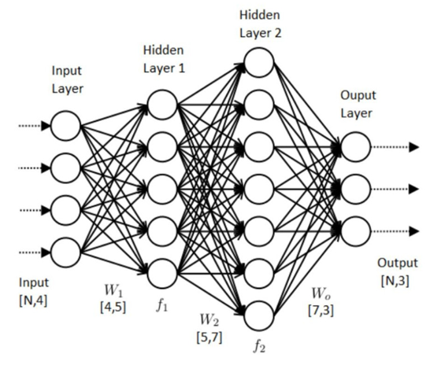
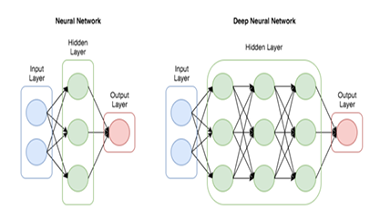
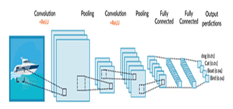
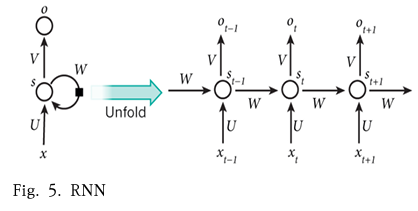

## 서론
### 1) 연구 배경
- 주식시장의 중요성 ↑ → 투자의 위험 줄이고 효율적인 자산관리를 위해 다양한 전략 모색
- 효율적인 포트폴리오 모델 : 다양한 자산에 대한 투자 최적화 → **기대 수익 극대화, 리스크 최소화** 에 중점
- 주식시장에서의 빅데이터 분석 : 투자 전략 수립, 시장 동향 예측, 리스크 관리

➡️ **빅데이터를 통한 주식시장의 성과분석에 관한 중요성 탐구**하고자 함

- **주식시장의 포트폴리오의 성과 측정 방식**
> 1) 백테스트 
>  - 과거 데이터를 활용하여 과거 기간 동안의 성과가 어떻게 되는지를 측정
>  - 장점 : 포트폴리오 모델의 실질적인 성과 평가 & 각종 위험 판단 & 다양한 구간에서의 시장의 움직임 이해
>  - 단점 : 과거 데이터를 기반으로 성과 분석을 진행하므로 과거 상황에만 특화된 모델이 선호됨
>
> 2) 시뮬레이션
>  - 다양한 금융 시장 상황에 따라 포트폴리오 성과가 어떠한 영향을 받는지 측정
>  - 여러 가지 금융 시장상황을 가정하여 미래 데이터를 시나리오화 → 포트폴리오 성과 측정
>  - 시나리오에 영향을 주는 **다양한 변수의 제한 및 변화**를 통해 다양한 경제 상황에 대한 **시나리오 발생가능성**을 기반으로 포트폴리오 성과 및 변화를 비교 분석

## 이론적 배경
### 1) 빅데이터 시대 
- 4V : Volume(규모), Velocity(속도), Variety(다양성), Veracity(정확성)
- 전통적 개념 : 대기업, NASA의 연구과학 프로젝트에서 분석하는 대용량 데이터
- 개념의 확장 : 시간 흐름상 데이터를 수집하고 처리하던 도구의 능력을 넘어서는 데이터들의 모임(기존의 툴이나 프로세스로 처리하기에는 너무 크고, 빠르고, 어려운 데이터를 의미)

➡️ 빅데이터(맥킨지) : 수집, 저장, 소통, 집단화, 분석이 가능한 거대한 데이터 풀

### 2) 주식시장과 빅데이터
- 주식시장은 정치, 사회, 경제 등 다양한 변수에 의해 서로 영향을 주고 받음 -> 주가 예측이 쉽지 않음
  - why? 주식시장의 흐름에는 너무 다양한 변수가 존재하고, 변수 간 상관관계도 명확하지 않으며, 시간에 따라 변하고, 주가의 움직임이 불규칙적

### 3) AI
- 지도학습, 준지도학습, 비지도학습, 강화학습으로 분류
  - 지도학습 : 입력과 출력 변수 사이의 관계를 학습하는데 사용(과거 데이터를 기반으로 미래 예측)
  - 준지도 학습 : 레이블이 일부만 지정된 데이터와 미분류 데이터를 사용하여 정확성 개선
  - 비지도 학습 : 출력 변수 없이 데이터의 패턴을 찾는 방식(클러스터링 구조, 저차원 다양체 등을 탐색)
  - 강화 학습 : 환경과의 상호작용을 통해 최적의 행동 학습(지연 보상, 시행착오를 통해 학습)

## 주식성과 예측
### 1) 인공지능을 활용한 빅데이터 주식성과 예측
- 사고, 학습, 추론 등 다양한 지적 작업을 수행할 수 있음
- 광범위성, 확산적 발전, 보완성을 갖춘 일반 목적 기술의 특성을 지니며, 네트워크 효과와 데이터 표준화, 락인 효과 등의 플랫폼 기술 특성도 동반
- 다양한 산업분야에서 시능형 서비스 및 시스템 자동화
  - 음성 비서 시스템, 사용자 추천 시스템, 자율주행차 등에서 활용
  - 빅데이터, 클라우드 컴퓨팅, IoT, 헬스케어 등의 기술과 융합

### 2) AI를 이용한 주식성과 예측(? AI 랑 인공지능이랑 달라?)
- 필요한 데이터 : 주가 정보, 주가 지수, 실시간 이슈 데이터 등
  - 주가 정보 : 종목 코드, 일자, 현재 주가, 전일 대비 등락률, 시가, 고가, 저가, 거래량, 전일가, 전일 거래량, 상한가 및 하한가, PER, PBR, 외국인 비율, 액면가, 자본금, 상장 주식 수, 시가 총액 등
  - 주가 지수 : 개별 종목의 주가 흐름을 분석하는 것을 넘어 전체 시장의 흐름 이해 가능
    - 종합 주가 지수 : 여러 종목의 주가 변동을 종합하여 하나의 지수로 나타냄(업종별, 규모별 등 다양한 범주로 그룹화하여 시장의 전반적인 상황 파악)

➡️ AI 는 다양한 데이터를 활용하여 주가 예측 모델(수학적 알고리즘과 통계 기법 활용하여 시장의 복잡한 패턴 예측)을 구축하고, 과거 데이터를 기반으로 주가의 방향을 예측하는데 활용됨

### 3) 주식성과 예측
- ANN, DNN, KNN, CNN, RNN, LSTM 등이 주로 사용

#### ANN(인공신경망)


- 여러 층의 뉴런으로 구성된 네트워크 
- 입력 데이터와 가중치를 조정하여 복잡한 비선형 관계를 모델링하며, 오차 역전파 알고리즘을 통해 학습

```
❓오차 역전파 알고리즘 Backpropagation

1) 순전파 (Foward propagation)
- 입력 데이터를 받아 층을 거치며 계산하여 최종 출력값을 얻음

2) 오차 계산 (Error calculation)
- 출력값과 실제 정답 간의 차이를 손실 함수로 계산

3) 역전파 (Backpropagation)
- 출력층 -> 은닉층 -> 입력층 방향으로, 오차의 기여도를 미분으로 계산(각 가중치가 오차에 얼마나 영향을 미쳤는지)

4) 가중치 갱신
- 경사 하강법(Gradient Descent)을 통해, 오차를 줄이는 방향으로 가중치와 편향 업데이트
```

#### DNN(심층신경망)


- ANN의 한 종류로, 여러 층의 비선형 변환기법을 조합하여 높은 수준의 추상화를 시도하는 기계학습 알고리즘
- 대규모 데이터셋에서 복잡한 패턴을 학습하고 주가 예측에서도 뛰어난 성과를 보이고 있음(어떻게?)

#### KNN(K-최근접 이웃 알고리즘)
- 비모수 방식의 학습 알고리즘으로, 입력데이터와 가장 가까운 이웃 데이터들을 기반으로 예측 수행
- 주가 예측 : 유사한 시점의 주가 데이터를 비교하여 추세를 예측

#### CNN(합성곱 신경망)


- 주로 이미지 처리에 사용
- 주가 예측 : 시계열 데이터의 특성을 고려하여 적용(주가 데이터의 시계열적 패턴을 학습하고 예측하는데 유리)

#### RNN(순환신경망), LSTM


- 시계열 데이터의 시간적 의존 관계를 잘 처리하는데 적합
- RNN : 순환적 구조를 가지며, 직전 시간 단계의 출력을 현재 시점의 입력으로 사용
- LSTM : RNN의 장기 의존 관계를 학습하기 위해 게이트 메커니즘을 도입하여 장기 기억 관리

```
❓RNN
- 이전 시점의 정보를 은닉상태에 저장해두고, 새로운 입력과 함께 다음 출력 계산에 활용
- 문제점 : 긴 시퀀스를 다루면 기울기 소실 문제 발생 -> 멀리 있는 과거 정보가 학습 도중 사라져버림(ex. 긴 문장에서 앞의 단어 정보가 뒤로 갈수록 반영되지 않음)

➡️ LSTM
- RNN의 기울기 소실 문제 해결
- 셀 상태라는 별도 메모리를 두고, 정보를 게이트(입력 게이트, 망각 게이트, 출력 게이트)를 통해 조절
```

### 4) 주가 예측을 위한 모델 분석
#### ANN
- 인공신경망 예측 주가 속성 : 상장 시기, 수요 예측, 경쟁률, 공모액, 주가 상/하 가격, 수익률, 공모시장 / 이슈 실시간 반영 x
- 주식 예측률 69.21% (오타인가?)
- ANN모델은 단일 최상의 인스턴스, 관측 공간에서 가중치 조합을 찾는 장점이 있음

➡️ 주투자자들에게 IPO 진입장벽을 낮출 수는 있으나, **예측 경쟁률**을 독립변수로 활용할 수 없을 시 예측 불일치 결과를 초래할 수 있는 단점

#### DNN
- 예측 주가 속성 : 이동평균 종가, 이동평균 거래량, 단순가격 / 이슈 실시간 반영 x
- 주식 예측률 51.01%

➡️ 주식 변동 패턴을 높은 확률로 예측 가능하지만, 간단한 구조의 데이터 입력과 단순한 구조의 네트워크를 이용한 단점

#### KNN
- 예측 주가 속성 : 시가, 저가, 고가, 종가 / 이슈 실시간 반영 x
- 랜덤 위크 모델에 비해 데이터마이닝의 방법론이 예측력을 향상시키는데 어려움이 있음
``` 
❓랜덤 위크 모델
- 주가가 본질적으로 예측 불가능하며, 내일 주가는 오늘 주가에 무작위 충격이 더해진다는 가설
- 예측력이 낮지만, 오히려 베이스라인으로 자주 쓰임

VS KNN
- KNN은 과거 비슷한 시점의 데이터를 찾아서 그 이웃들의 주가 흐름을 근거로 미래 예측
- 주가는 변동성이 높고 패턴이 뚜렷하지 않은 경우가 많아, KNN의 유사성 기반 추론이 잘 작동하지 않을 수 있음
```

#### CNN
- 예측 주가 속성 : KOSPI200 주가 지수를 활용 / 이슈 실시간 반영 x
- 주식 예측률 : 57.74%(타 모델과 비교해 가장 우수한 정확도??..?)
- 단점 : 그래프의 변동성을 이용하여 예측을 진행하는 알고리즘의 일반성이 검증되지 못함

#### RNN
- 예측 주가 속성 : 실적 공시일 전일부터 45일간의 매수 및 매도 거래량을 사용 / 이슈 실시간 반영 x
- 주식 예측률 : 50% 이상.. 
- 복잡한 분류가 가능하나 개인 투자자의 거래 정보를 실제 투자에 활용하는데 한계가 있음

#### LSTM
- 예측 주가 속성 : 시가, 고가, 저가, 종가, 거래량 / 이슈 실시간 반영 x
- 주식 예측률 : 84.9%..?
- 다른 인공지능 모델 중 가장 높은 주식 예측률
- 단방향 LSTM 순환신경망보다 양방향 LSTM 순환신경망을 이용했을 때 더 높음

## 결론
- 양방향 LSTM 외에도 트랜스포머 모델, 그래프 신경망(GNN), 강화학습 등 최신 AI 기술들을 포함하여 분석함
  - 양방향 LSTM 은 시계여려 데이터의 장기 의존 관계를 학습하는 데 뛰어난 성능
  - 트랜스포머 모델 : 병렬 처리를 통한 효율적 데이터 처리와 예측 정확도 면에서 우수
  - 그래프 신경망 : 주식 간의 복잡한 상관관계를 효과적으로 모델링하여 예측 성과 향상
  - 강화 학습 : 변동성이 큰 시장에서 적응력이 뛰어난 투자 전략을 학습하는 데 유용
- 트랜스포머와 그래프 신경망의 활용은 주식 예측의 정확성을 크게 높일 가능성을 보여주어서 향후에도 이러한 알고리즘을 더욱 발전시켜 주식 예측의 성능 개선을 기대.

